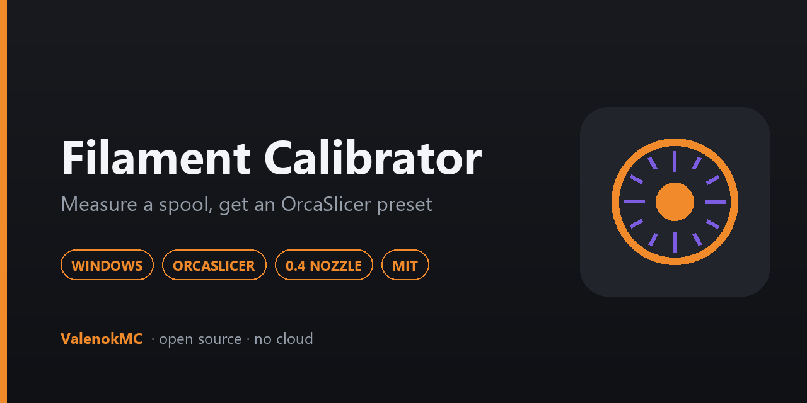
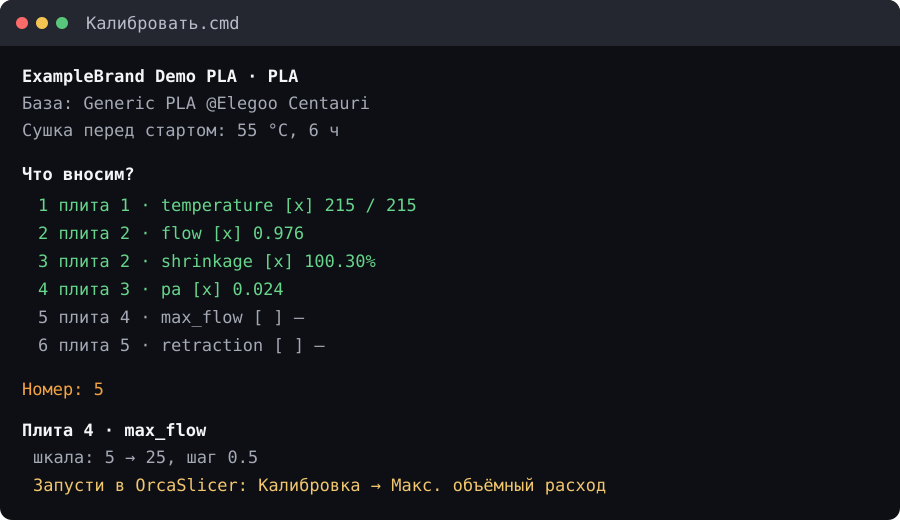

<div align="center">



# Centauri Carbon Filament Calibrator

**Calibrate a new spool step by step and get a ready OrcaSlicer preset — temperature, flow, pressure advance, max flow, retraction and shrinkage.**

[](https://github.com/ValenokMC/Centauri-Carbon-Filament-Calibrator/releases/latest)
[](https://github.com/ValenokMC/Centauri-Carbon-Filament-Calibrator/releases)
[](https://github.com/ValenokMC/Centauri-Carbon-Filament-Calibrator/actions)
[](#compatibility)
[](#compatibility)
[](#compatibility)
[](LICENSE)
[](https://t.me/SupporBiBot?start=centauri_calibrator)

**English** · [Русский](README_RU.md)

[Changelog](CHANGELOG.md) · [Documentation](docs/installation.md) · [Support](SUPPORT.md) · [Telegram](https://t.me/SupporBiBot?start=centauri_calibrator) · [Support the author](https://web.tribute.tg/d/P54)

### [⬇ Download for Windows](https://github.com/ValenokMC/Centauri-Carbon-Filament-Calibrator/releases/latest)

</div>

---

## Requirements

| | |
|---|---|
| **Operating system** | Windows 10 or 11 |
| **Python** | 3.9 or newer — [python.org](https://www.python.org/downloads/), tick *Add python.exe to PATH* |
| **Slicer** | OrcaSlicer 2.4.2, with the profile for the active firmware installed |
| **Printer** | Elegoo Centauri Carbon, **0.4 mm nozzle** |
| **Tools** | A caliper. That is the only hardware you need beyond the printer. |

---

## Screenshot

<div align="center">

</div>

Enter a measurement, get a preset field. Stop whenever you like and pick it up
tomorrow — a calibration takes hours, with a print between each plate.

---

## Why this project

Every spool is different, even two of the same brand and colour. The generic
profile is a starting point, not an answer, and the difference between a generic
PLA profile and a calibrated one is the difference between prints that mostly
work and prints that reliably do.

The problem is that calibrating properly means six tests, each with its own
scale, its own formula, and its own way of being misread. Doing that by hand
means keeping a spreadsheet, remembering that flow must be measured at the final
temperature, and typing the results into the right preset fields without a typo.

This does the bookkeeping.

- **It knows the order.** Flow is measured at the final temperature, pressure
  advance at the final flow, max flow at the final PA. After each accepted
  result it updates the spool preset; select that preset in Orca's next live
  calibration wizard.
- **It refuses an impossible measurement.** A caliper reading off by a factor of
  ten produces a plausible-looking number that would quietly ruin every print
  made afterwards. Each formula has bounds, and rejecting the value says which
  mistake is likely.
- **It writes an overlay, not a full profile.** Only the fields you measured.
  Everything else is inherited, so an Elegoo profile update does not wipe your
  calibration.
- **You can stop at any point.** Answers are kept per spool. Come back next week
  and continue.

---

## Quick Start

1. **Download and unpack** the [Windows ZIP](https://github.com/ValenokMC/Centauri-Carbon-Filament-Calibrator/releases/latest).
2. **Run `Setup.cmd`.** It finds OrcaSlicer, asks whether the printer uses stock
   firmware or COSMOS, selects that firmware's exact printer preset, and finds
   the folders where Orca reads user presets.
3. **Run `Калибровать.cmd`** (or `Run.cmd`). Choose a material and name the spool.
4. **Follow the screen.** For five tests it gives the exact values to enter in
   Orca's live Calibration wizard. The included 100 mm shrinkage bar opens
   automatically. Print, inspect or measure, then type the result.

Full walkthrough: **[docs/installation.md](docs/installation.md)** ·
Test-by-test guide: **[docs/calibration.md](docs/calibration.md)**

---

## What it calibrates

| # | Test | Measured how | Preset field |
|---|---|---|---|
| 1 | **Temperature** | Best block on a tower | `nozzle_temperature` |
| 2 | **Flow** | Flattest tile on Orca's flow test | `filament_flow_ratio` |
| 2b | **Shrinkage** | A 100 mm bar with a caliper | `filament_shrink` |
| 3 | **Pressure advance** | Sharpest corner on the pattern | `pressure_advance` |
| 4 | **Max volumetric flow** | Height where under-extrusion starts | `filament_max_volumetric_speed` |
| 5 | **Retraction** | Cleanest block on a tower | `filament_retraction_length` |

Materials with scales: **PLA · PETG · PETG-CF · PETG-GF · ABS · ASA · PA · TPU**,
each with its own base profile and drying recommendation.

---

## Compatibility

| | Status |
|---|---|
| Windows 10 / 11 | ✅ Tested |
| **OrcaSlicer 2.4.2** | ✅ Tested |
| Other OrcaSlicer versions | ⚠️ Not tested — profile paths and key names move between versions |
| Elegoo Centauri Carbon, **0.4 mm nozzle** | ✅ Tested |
| Stock Elegoo firmware / SDCP | ✅ Tested |
| OpenCentauri / COSMOS / Moonraker | ⚠️ Context and preset isolation tested; end-to-end printer validation pending |
| Other nozzle sizes | ❌ The plates are built for 0.4; a 0.2 would print something meaningless |
| Centauri Carbon 2, other printers | ❌ Not supported, not tested |
| macOS, Linux | ❌ Not supported — Windows paths and launchers throughout |
| Other base profiles | ❌ The scales are tied to the Elegoo profiles |

Everything above marked ❌ or ⚠️ is a genuine "not tested", not a hedge. Claiming
otherwise would mean somebody prints six plates over two days and gets a number
that describes nothing.

**Interface language:** Russian. Code, documentation and issue templates are
English.

---

## Safety

The calibrator writes to exactly one place outside its own data directory: your
OrcaSlicer filament preset folder. That write is the most dangerous thing it
does, so:

- **The exact path is shown, and you confirm it** before anything happens.
- **An existing preset is backed up first**, into `preset-backups\` with a
  timestamp.
- **The JSON is validated, written to a temporary file, then moved into place.**
  A failure at any point leaves the original untouched. There is a test that
  proves it.
- **`Dry-Run.cmd` writes nothing at all** — walk the whole dialog and see what
  would happen.
- **Firmware contexts stay separate.** Stock measurements cannot be resumed
  under COSMOS. COSMOS presets use their own names and attach only to the exact
  selected COSMOS machine preset.

**OrcaSlicer is never force-killed.** It is asked to close, politely, and if it
is sitting on an unsaved-project dialog the calibrator stops and asks you to deal
with it. A `taskkill /F` would throw away hours of your work to save a restart.

More: [docs/security.md](docs/security.md)

---

## About the calibration plates

Five of the six tests use **OrcaSlicer's own live Calibration wizard**. Its
models carry the labels and real test features needed for a useful result.

Their licence is not stated anywhere this project can point to, so they are
**not redistributed here**. Instead:

- Temperature, flow, pressure advance, max flow and retraction are started
  directly from Orca's menu while the calibrator is running. **Do not save and
  reopen them as reusable projects:** an ordinary 3MF keeps the geometry but
  silently loses Orca's active calibration mode.
- The **100 × 10 × 3 mm shrinkage bar is generated from scratch** by this
  project, is included in the ZIP and opens automatically.
- `Prepare-Templates.cmd` remains only as a compatibility shortcut explaining
  this workflow; there is nothing to prepare or import.

Details: [docs/templates.md](docs/templates.md)

---

## Your data

```
%LOCALAPPDATA%\CentauriCarbonFilamentCalibrator\
├── config.json          what setup found
├── Journal.csv          one row per calibrated spool
├── spools\              measurements, per spool, per run
├── preset-backups\      every preset replaced, timestamped
├── support.json         date of the optional monthly support note
└── logs\
```

Outside the program folder, so updating cannot touch it. Nothing here is ever
published; `examples/Journal.example.csv` in the repository is entirely invented.

---

## Troubleshooting

| Symptom | Likely cause |
|---|---|
| OrcaSlicer not found | Installed somewhere unusual — `Setup.cmd` lets you point at it. |
| Base profile not found | The Elegoo vendor profiles are not installed in Orca. |
| The preset does not appear | Orca reads presets at start-up. Restart it. |
| The preset appears but is not selectable | It is compatible with printer presets it knows about; re-run `Setup.cmd` after adding a printer preset. |
| A measurement is rejected | Usually right. Read the message — it says which mistake is likely. |
| A test uses the wrong filament | Restart Orca after the previous result and select the updated spool preset in the live wizard. |

Start with **`Doctor.cmd`** — read-only, changes nothing, and prints everything
the program can see.

Full guide: [docs/troubleshooting.md](docs/troubleshooting.md)

---

## Support

1. [Documentation](docs/installation.md)
2. [Discussions](https://github.com/ValenokMC/Centauri-Carbon-Filament-Calibrator/discussions)
3. [Issues](https://github.com/ValenokMC/Centauri-Carbon-Filament-Calibrator/issues)
4. [@SupporBiBot](https://t.me/SupporBiBot?start=centauri_calibrator)

One-person project; an answer may take a few days. Read [SUPPORT.md](SUPPORT.md)
first — in particular, a `.3mf` you saved yourself may contain your printer's
address, so check before attaching one.

---

## Support the author

If the calibrator turned out to be useful:

<div align="center">

### [☕ Support on Tribute](https://web.tribute.tg/d/P54)

</div>

Nothing is paid for, nothing is locked, nothing is measured. The program mentions
this at most once every 30 days, after a preset has been saved successfully —
never on an error, never on a cancellation, never in a dry run.

---

## Development

```bash
git clone https://github.com/ValenokMC/Centauri-Carbon-Filament-Calibrator.git
cd Centauri-Carbon-Filament-Calibrator
python -m pip install -r requirements-dev.txt
python -m pytest tests/ -q
python tools/check_public_safety.py
```

The tests never touch a real OrcaSlicer installation, never write to your real
`%LOCALAPPDATA%`, and never close a running slicer — there are fixtures that
make each of those an error.

See [CONTRIBUTING.md](CONTRIBUTING.md) and [docs/architecture.md](docs/architecture.md).

---

## License and third-party components

[MIT](LICENSE) © ValenokMC. No third-party runtime dependencies.

Read [THIRD_PARTY_NOTICES.md](THIRD_PARTY_NOTICES.md) — it explains what is and
is not redistributed here, and why Orca's five tests run from its live wizard.

Not affiliated with Elegoo or with the OrcaSlicer project. Both names are used
descriptively, to say what this works with.
